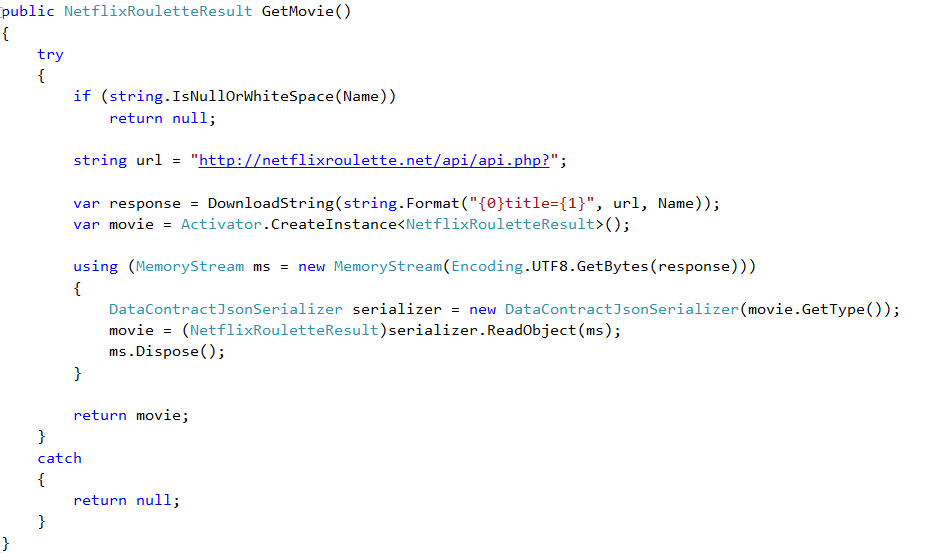

# Embeddinator-4000 Sample

Embedding .NET code into your iOS, Android, and macOS applications. See the getting started at: [https://github.com/mono/Embeddinator-4000](https://github.com/mono/Embeddinator-4000)

## Sample

We started with a portable class library developed in C# that allows to access to movie information using the [netflixroulette](https://netflixroulette.net) API.

Use Embeddinator-4000 to generates the necessary glue to surface the .NET API as a native API.

